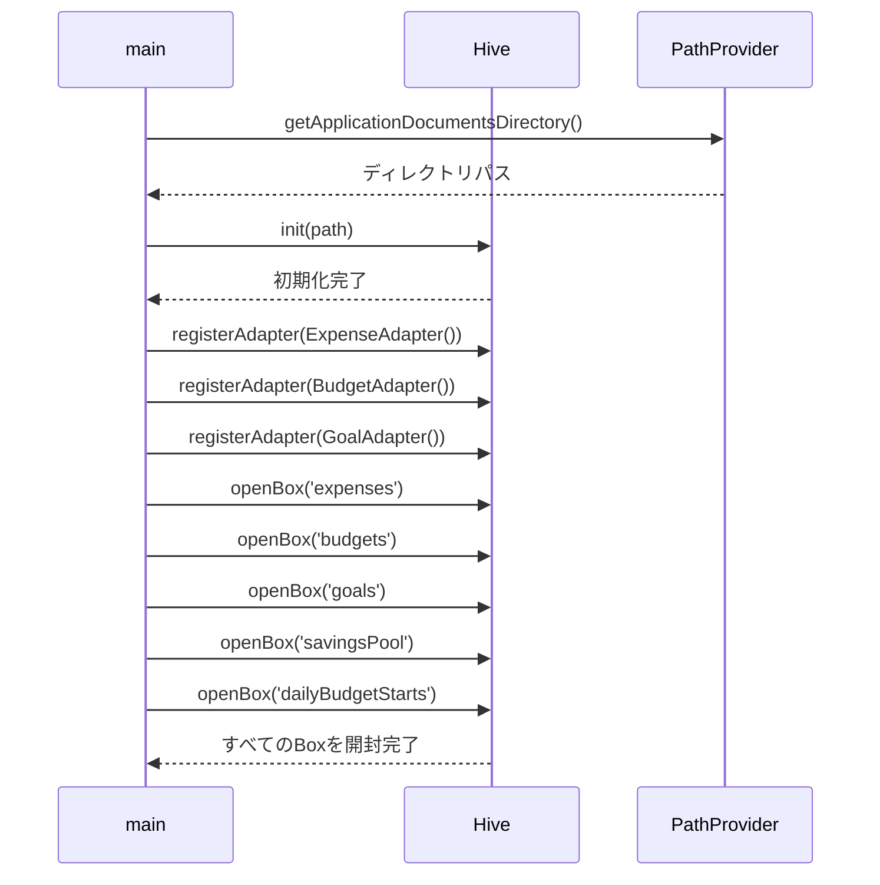
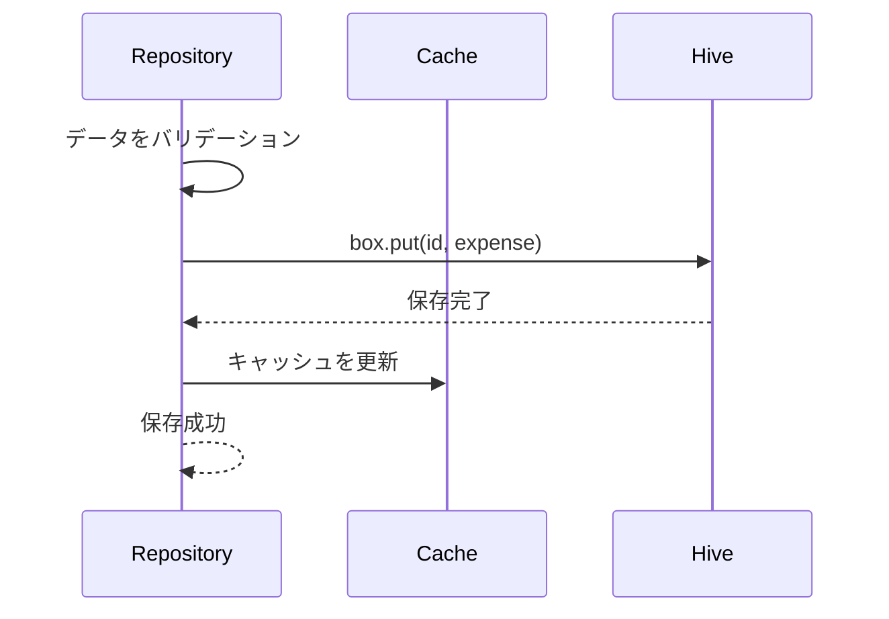

# 機能設計書

## 基本情報

### 機能名
データ永続化機能

### 目的
すべてのアプリデータをローカルに保存し、キャッシュにより高速なデータアクセスを実現する。

### この機能で実現すること
- ローカルデータベース（Hive）によるデータ永続化
- メモリキャッシュによる高速アクセス
- データのバックアップ・リストア（将来実装）
- データのエクスポート・インポート（将来実装）

### ユーザー体験を良くするために実装すること
- 高速なデータ読み込み
- オフライン対応
- データの自動保存
- エラー時の復旧機能

---

## 実装設計

### 1. 画面構成
なし（バックグラウンド機能）

### 2. Firebaseスキーマ定義
なし（ローカルDB使用）

### 3. Cloud Functions API設計
なし（ローカルアプリ）

### 4. 小機能一覧と実装内容

#### 4.1 Hiveの初期化
- **Hive初期化**
  - アプリ起動時にHiveを初期化
  - TypeAdapterの登録
  - Boxの開封

#### 4.2 データの保存・読み込み
- **支出データ（Expense）**
  - Box: `expenses`
  - TypeId: 0

- **予算データ（Budget）**
  - Box: `budgets`
  - キー: 年月（YYYY-MM）またはdefault
  - TypeId: 1

- **日別予算スタート値（DailyBudgetStart）**
  - Box: `dailyBudgetStarts`
  - キー: 日付（YYYY-MM-DD）
  - TypeId: 2

- **貯蓄目標（Goal）**
  - Box: `goals`
  - TypeId: 3

- **総貯蓄額プール（SavingsPool）**
  - Box: `savingsPool`
  - シングルオブジェクト
  - TypeId: 4

- **プール履歴（PoolTransaction）**
  - SavingsPool内のhistory配列
  - TypeId: 5

- **テーマ設定**
  - SharedPreferences
  - キー: `theme`

#### 4.3 キャッシュシステム
- **メモリキャッシュ**
  - 頻繁にアクセスするデータをメモリに保持
  - 書き込み時にキャッシュを更新

- **キャッシュ無効化**
  - データ更新時にキャッシュをクリア
  - 必要に応じて再読み込み

#### 4.4 エラーハンドリング
- **読み込みエラー**
  - try-catchで捕捉
  - デフォルト値を返却
  - エラーログを記録

- **書き込みエラー**
  - try-catchで捕捉
  - ユーザーに通知
  - リトライ機構（将来実装）

### 5. 使用パッケージ
- `hive` / `hive_flutter` - ローカルデータベース
- `path_provider` - データ保存パスの取得
- `shared_preferences` - 設定の保存

### 6. シーケンス図

#### Hiveの初期化


#### データの保存（例: 支出）


---

## データモデル

### TypeAdapter登録

```dart
// main.dart
void main() async {
  WidgetsFlutterBinding.ensureInitialized();

  // Hive初期化
  final appDocDir = await getApplicationDocumentsDirectory();
  await Hive.initFlutter(appDocDir.path);

  // TypeAdapter登録
  Hive.registerAdapter(ExpenseAdapter());
  Hive.registerAdapter(CategoryAdapter());
  Hive.registerAdapter(BudgetAdapter());
  Hive.registerAdapter(CalculationTypeAdapter());
  Hive.registerAdapter(ApplyRangeAdapter());
  Hive.registerAdapter(DailyBudgetStartAdapter());
  Hive.registerAdapter(GoalAdapter());
  Hive.registerAdapter(SavingsPoolAdapter());
  Hive.registerAdapter(PoolTransactionAdapter());
  Hive.registerAdapter(TransactionTypeAdapter());

  // Box開封
  await Hive.openBox<Expense>('expenses');
  await Hive.openBox('budgets');
  await Hive.openBox<Goal>('goals');
  await Hive.openBox('savingsPool');
  await Hive.openBox('dailyBudgetStarts');

  runApp(MyApp());
}
```

---

## プロトタイプ実装箇所（参照）

### ロジック
- `app.js`
  - `MoneyPouchApp._cache` - キャッシュオブジェクト
  - `MoneyPouchApp.clearCache()` - キャッシュクリア
  - LocalStorage操作メソッド

---

## テストケース

### 単体テスト
- [ ] Hiveの初期化が正しく動作する
- [ ] TypeAdapterの登録が正しく動作する
- [ ] データの保存が正しく動作する
- [ ] データの読み込みが正しく動作する
- [ ] キャッシュが正しく動作する
- [ ] キャッシュの無効化が正しく動作する

### 統合テスト
- [ ] 支出データの保存・読み込みが正しく動作する
- [ ] 予算データの保存・読み込みが正しく動作する
- [ ] 目標データの保存・読み込みが正しく動作する
- [ ] プールデータの保存・読み込みが正しく動作する
- [ ] アプリ再起動後もデータが保持される

### パフォーマンステスト
- [ ] 大量データ（1000件以上）の読み込みが高速
- [ ] キャッシュによる高速化が有効
