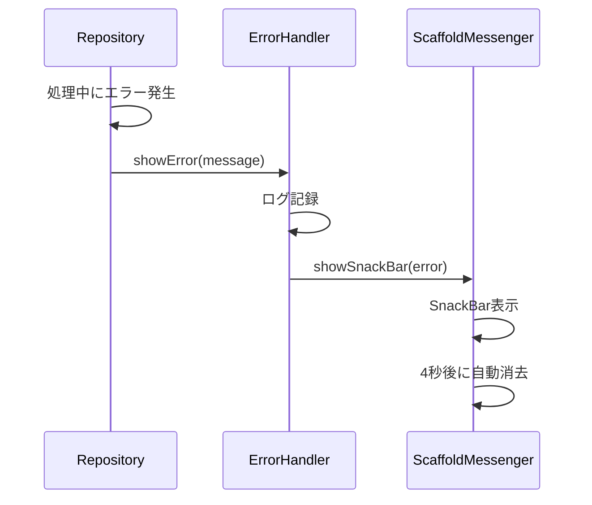
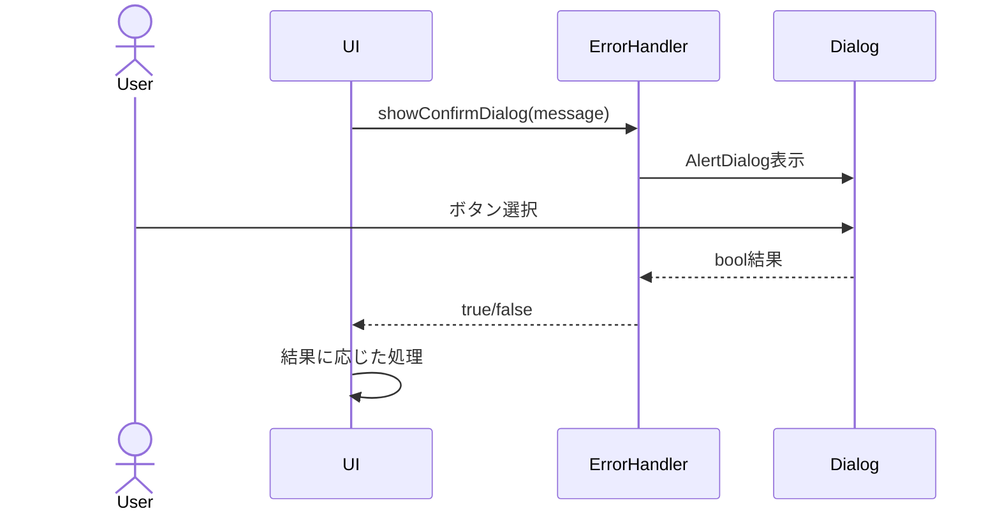

# 機能設計書

## 基本情報

### 機能名
エラーハンドリング機能

### 目的
エラーログの記録とユーザーへの通知を統一的に管理する。

### この機能で実現すること
- エラーログの記録
- エラーメッセージの表示（SnackBar）
- 成功メッセージの表示
- 確認ダイアログ
- グローバルエラーハンドラー

### ユーザー体験を良くするために実装すること
- わかりやすいエラーメッセージ
- 視覚的なフィードバック（色、アイコン）
- 非侵入的な通知（SnackBar）
- エラーからの復旧方法の提示

---

## 実装設計

### 1. 画面構成
なし（ユーティリティ機能）

### 2. Firebaseスキーマ定義
なし

### 3. Cloud Functions API設計
なし

### 4. 小機能一覧と実装内容

#### 4.1 エラーログ
- **コンソールログ**
  - タイムスタンプ付き
  - エラーレベル（ERROR, WARNING, INFO）
  - スタックトレース

#### 4.2 ユーザー通知
- **エラーメッセージ表示**
  - SnackBar（赤色背景）
  - エラーアイコン
  - 自動消去（4秒）

- **成功メッセージ表示**
  - SnackBar（緑色背景）
  - 成功アイコン
  - 自動消去（2秒）

- **情報メッセージ表示**
  - SnackBar（青色背景）
  - 情報アイコン
  - 自動消去（3秒）

#### 4.3 確認ダイアログ
- **削除確認**
  - タイトル
  - メッセージ
  - キャンセル/削除ボタン

- **汎用確認**
  - カスタマイズ可能なタイトル・メッセージ
  - キャンセル/確認ボタン

#### 4.4 グローバルエラーハンドラー
- **未処理例外のキャッチ**
  - FlutterError.onError
  - エラーログ記録
  - ユーザーに通知

### 5. 使用パッケージ
なし（Flutter標準機能）

### 6. シーケンス図

#### エラー表示


#### 確認ダイアログ


---

## データモデル

### ErrorHandler（ユーティリティクラス）

```dart
import 'package:flutter/material.dart';

class ErrorHandler {
  // エラーメッセージ表示
  static void showError(BuildContext context, String message) {
    _log('ERROR', message);
    _showSnackBar(
      context,
      message,
      backgroundColor: Colors.red[700]!,
      icon: Icons.error_outline,
      duration: const Duration(seconds: 4),
    );
  }

  // 成功メッセージ表示
  static void showSuccess(BuildContext context, String message) {
    _log('SUCCESS', message);
    _showSnackBar(
      context,
      message,
      backgroundColor: Colors.green[700]!,
      icon: Icons.check_circle_outline,
      duration: const Duration(seconds: 2),
    );
  }

  // 情報メッセージ表示
  static void showInfo(BuildContext context, String message) {
    _log('INFO', message);
    _showSnackBar(
      context,
      message,
      backgroundColor: Colors.blue[700]!,
      icon: Icons.info_outline,
      duration: const Duration(seconds: 3),
    );
  }

  // SnackBar表示
  static void _showSnackBar(
    BuildContext context,
    String message, {
    required Color backgroundColor,
    required IconData icon,
    required Duration duration,
  }) {
    ScaffoldMessenger.of(context).showSnackBar(
      SnackBar(
        content: Row(
          children: [
            Icon(icon, color: Colors.white),
            const SizedBox(width: 12),
            Expanded(
              child: Text(
                message,
                style: const TextStyle(color: Colors.white),
              ),
            ),
          ],
        ),
        backgroundColor: backgroundColor,
        duration: duration,
        behavior: SnackBarBehavior.floating,
        shape: RoundedRectangleBorder(
          borderRadius: BorderRadius.circular(10),
        ),
      ),
    );
  }

  // 確認ダイアログ表示
  static Future<bool> showConfirmDialog(
    BuildContext context, {
    required String title,
    required String message,
    String confirmText = '確認',
    String cancelText = 'キャンセル',
  }) async {
    final result = await showDialog<bool>(
      context: context,
      builder: (context) => AlertDialog(
        title: Text(title),
        content: Text(message),
        actions: [
          TextButton(
            onPressed: () => Navigator.of(context).pop(false),
            child: Text(cancelText),
          ),
          TextButton(
            onPressed: () => Navigator.of(context).pop(true),
            child: Text(confirmText),
          ),
        ],
      ),
    );

    return result ?? false;
  }

  // 削除確認ダイアログ
  static Future<bool> showDeleteConfirmDialog(
    BuildContext context,
    String itemName,
  ) async {
    return showConfirmDialog(
      context,
      title: '削除確認',
      message: '$itemNameを削除しますか？\nこの操作は元に戻せません。',
      confirmText: '削除',
      cancelText: 'キャンセル',
    );
  }

  // ログ記録
  static void _log(String level, String message) {
    final timestamp = DateTime.now().toIso8601String();
    debugPrint('[$timestamp] [$level] $message');
  }

  // グローバルエラーハンドラー設定
  static void setupGlobalErrorHandler() {
    FlutterError.onError = (details) {
      _log('ERROR', details.exception.toString());
      _log('STACK', details.stack.toString());
    };
  }
}
```

---

## プロトタイプ実装箇所（参照）

### ロジック
- `js/error-handler.js`
  - `ErrorHandler.log()` - ログ記録
  - `ErrorHandler.showError()` - エラー表示
  - `ErrorHandler.showSuccess()` - 成功表示
  - `ErrorHandler.confirm()` - 確認ダイアログ

---

## テストケース

### 単体テスト
- [ ] エラーメッセージが正しく表示される
- [ ] 成功メッセージが正しく表示される
- [ ] 確認ダイアログが正しく動作する
- [ ] ログが正しく記録される

### 統合テスト
- [ ] エラー発生時にSnackBarが表示される
- [ ] 成功時にSnackBarが表示される
- [ ] 削除確認ダイアログが正しく動作する

### UIテスト
- [ ] SnackBarが視認できる
- [ ] SnackBarが自動消去される
- [ ] 確認ダイアログが正しく表示される
