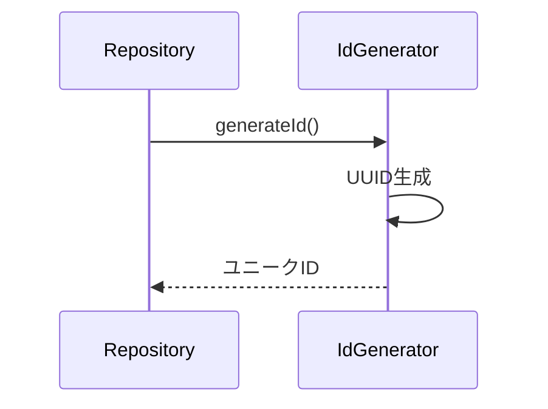

# 機能設計書

## 基本情報

### 機能名
ユーティリティ機能

### 目的
ID生成などの共通ユーティリティを提供する。

### この機能で実現すること
- ユニークID生成
- 共通ヘルパー関数

### ユーザー体験を良くするために実装すること
- IDの衝突回避
- 効率的なデータ管理

---

## 実装設計

### 1. 画面構成
なし（ユーティリティ機能）

### 2. Firebaseスキーマ定義
なし

### 3. Cloud Functions API設計
なし

### 4. 小機能一覧と実装内容

#### 4.1 ID生成
- **ユニークID生成**
  - UUIDの使用
  - タイムスタンプベースのID
  - 衝突回避

#### 4.2 その他ヘルパー
- **リスト操作**
  - ソート
  - フィルター
  - グループ化

### 5. 使用パッケージ
- `uuid` - UUID生成

### 6. シーケンス図

#### ID生成


---

## データモデル

### IdGenerator（ユーティリティクラス）

```dart
import 'package:uuid/uuid.dart';

class IdGenerator {
  static const _uuid = Uuid();

  // UUID v4生成
  static String generate() {
    return _uuid.v4();
  }

  // プレフィックス付きID生成
  static String generateWithPrefix(String prefix) {
    return '${prefix}_${_uuid.v4()}';
  }

  // タイムスタンプベースID生成
  static String generateTimestampBased(String prefix) {
    final timestamp = DateTime.now().millisecondsSinceEpoch;
    final random = _uuid.v4().substring(0, 8);
    return '${prefix}_${timestamp}_$random';
  }
}
```

### ListHelpers（リスト操作ヘルパー）

```dart
class ListHelpers {
  // 日付でグループ化
  static Map<String, List<T>> groupByDate<T>(
    List<T> items,
    String Function(T) getDate,
  ) {
    final Map<String, List<T>> grouped = {};

    for (final item in items) {
      final date = getDate(item);
      grouped.putIfAbsent(date, () => []).add(item);
    }

    return grouped;
  }

  // 降順ソート
  static List<T> sortByDateDesc<T>(
    List<T> items,
    DateTime Function(T) getDate,
  ) {
    final sorted = List<T>.from(items);
    sorted.sort((a, b) => getDate(b).compareTo(getDate(a)));
    return sorted;
  }
}
```

---

## プロトタイプ実装箇所（参照）

### ロジック
- `app.js`
  - `MoneyPouchApp.generateId()` - ID生成
- `js/ui-common.js` - UI共通処理

---

## テストケース

### 単体テスト
- [ ] ID生成が正しく動作する
- [ ] 生成されたIDがユニーク
- [ ] プレフィックス付きID生成が正しく動作する

### 統合テスト
- [ ] 生成されたIDがHiveで正しく保存される
