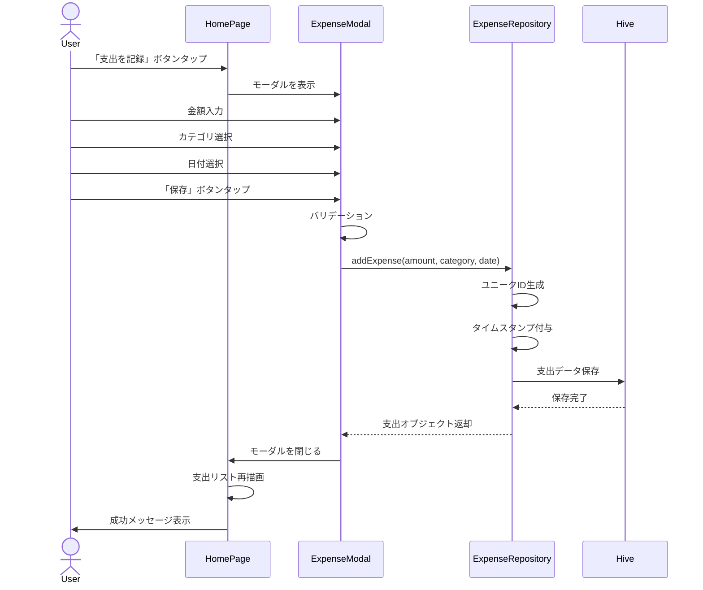
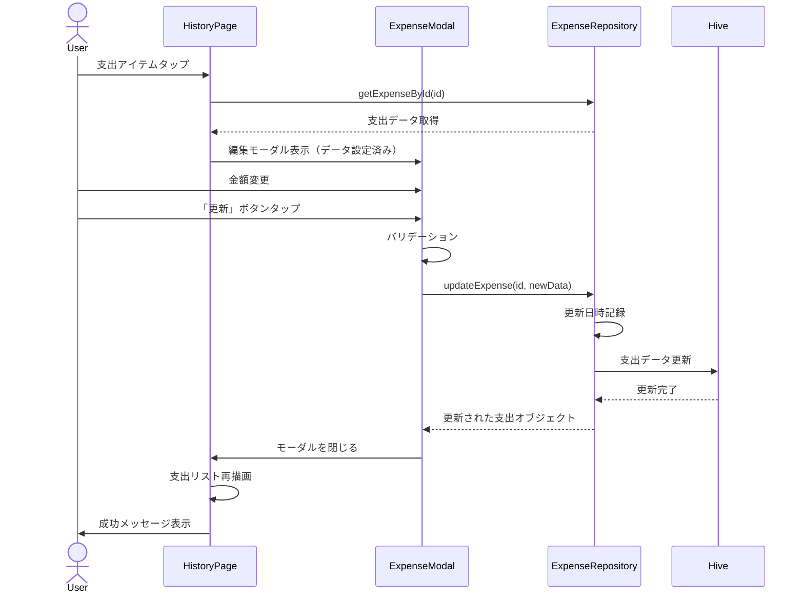
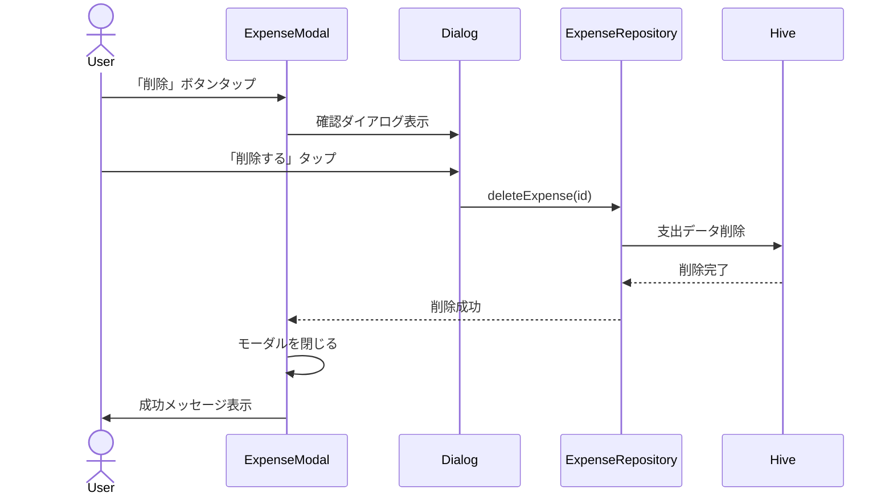

# 機能設計書

## 基本情報

### 機能名
支出管理機能

### 目的
日々の支出を記録し、いつ・いくら・何に使ったかを可視化することで、ユーザーが自身の消費行動を把握できるようにする。

### この機能で実現すること
- 支出の新規登録（金額、カテゴリ、日付）
- 登録済み支出の編集・削除
- 支出履歴の一覧表示（最近の支出、日別グループ表示）
- カテゴリ別フィルタリング
- 月間・日別の支出集計

### ユーザー体験を良くするために実装すること
- 支出登録時のカテゴリアイコンによる視覚的な識別
- 日別グループ表示による時系列の把握
- もっと見る/閉じる機能による情報量の調整
- カテゴリフィルターによる素早い絞り込み
- タイムスタンプによる正確な記録時刻の保存
- スワイプアクションによる編集・削除の直感的な操作（Flutter実装時）

---

## 実装設計

### 1. 画面構成

#### ホーム画面（支出記録セクション）
- **残高カード**
  - 今月の予算残高
  - 今日の予算
- **支出記録ボタン**
  - フローティングアクションボタン
  - タップで支出追加モーダルを表示
- **最近の支出リスト**
  - 最新5件の支出を表示
  - もっと見るボタンで全件表示

#### 履歴画面
- **月選択バー**
  - 前月/次月ボタン
  - 現在選択中の年月表示
- **月間サマリーカード**
  - 今月の支出合計
  - 予算残高
  - カテゴリ別内訳（展開可能）
- **フィルターチップス**
  - すべて、食費、娯楽、交通費、買い物、医療、その他
- **日別グループリスト**
  - 日付ヘッダー（曜日付き）
  - 支出アイテム（カテゴリアイコン、時刻、金額）
  - 日別合計

#### 支出追加/編集モーダル
- **金額入力フィールド**（数値キーボード）
- **カテゴリ選択グリッド**（3×2のアイコングリッド）
- **日付選択**（DatePickerダイアログ）
- **保存/キャンセルボタン**
- **削除ボタン**（編集時のみ）

### 2. Firebaseスキーマ定義
なし（ローカルDB使用）

### 3. Cloud Functions API設計
なし（ローカルアプリ）

### 4. 小機能一覧と実装内容

#### 4.1 支出のCRUD操作
- **Create（作成）**
  - 入力: 金額（int）、カテゴリ（enum）、日付（DateTime）
  - 処理: ユニークID生成、タイムスタンプ付与、Hive保存
  - 出力: 作成された支出オブジェクト

- **Read（読み取り）**
  - 全支出取得: `List<Expense> getAllExpenses()`
  - 月別取得: `List<Expense> getExpensesByMonth(String yearMonth)`
  - 日別取得: `List<Expense> getExpensesByDate(DateTime date)`
  - キャッシュ機構により高速化

- **Update（更新）**
  - 入力: 支出ID、更新データ（金額、カテゴリ、日付）
  - 処理: バリデーション、更新日時記録、Hive保存
  - 出力: 更新された支出オブジェクト

- **Delete（削除）**
  - 入力: 支出ID
  - 処理: 確認ダイアログ表示、Hiveから削除
  - 出力: 削除成功フラグ

#### 4.2 支出の表示
- **最近の支出リスト**
  - デフォルト5件表示
  - 日付降順ソート
  - もっと見る/閉じる トグル機能

- **日別グループ表示**
  - 日付でグループ化（Map<DateTime, List<Expense>>）
  - 日付ヘッダー生成（M月D日（曜日））
  - 日別合計計算

#### 4.3 カテゴリフィルタリング
- フィルター適用: `List<Expense> filterByCategory(Category? category)`
- フィルター状態管理（Provider/Riverpod）

#### 4.4 支出の集計
- 月間集計: `int getTotalExpensesByMonth(String yearMonth)`
- 日別集計: `int getTotalExpensesByDate(DateTime date)`
- カテゴリ別集計: `Map<Category, int> getExpensesByCategory(String yearMonth)`

### 5. 使用パッケージ
- `hive` / `hive_flutter` - ローカルデータベース
- `uuid` - ユニークID生成
- `intl` - 日付フォーマット
- `provider` または `riverpod` - 状態管理
- `flutter_slidable` - スワイプアクション（編集・削除）
- `liquid_glass_renderer` - Glassmorphismデザイン

### 6. シーケンス図

#### 支出の新規登録


#### 支出の編集


#### 支出の削除


---

## データモデル

### Expense（支出）

```dart
@HiveType(typeId: 0)
class Expense {
  @HiveField(0)
  final String id;

  @HiveField(1)
  final int amount; // 金額（円）

  @HiveField(2)
  final Category category;

  @HiveField(3)
  final DateTime date; // 支出日（YYYY-MM-DD）

  @HiveField(4)
  final DateTime timestamp; // 記録日時

  @HiveField(5)
  final DateTime? updatedAt; // 更新日時

  Expense({
    required this.id,
    required this.amount,
    required this.category,
    required this.date,
    required this.timestamp,
    this.updatedAt,
  });
}
```

### Category（カテゴリ）

```dart
enum Category {
  @HiveField(0)
  food,        // 食費

  @HiveField(1)
  entertainment, // 娯楽

  @HiveField(2)
  transport,   // 交通費

  @HiveField(3)
  shopping,    // 買い物

  @HiveField(4)
  health,      // 医療

  @HiveField(5)
  other,       // その他
}
```

---

## プロトタイプ実装箇所（参照）

### ロジック
- `app.js`
  - `MoneyPouchApp.addExpense()` - 支出追加
  - `MoneyPouchApp.updateExpense()` - 支出更新
  - `MoneyPouchApp.deleteExpense()` - 支出削除
  - `MoneyPouchApp.getExpenses()` - 全支出取得
  - `MoneyPouchApp.getExpensesByMonth()` - 月別取得
  - `MoneyPouchApp.getTotalExpensesByMonth()` - 月間集計
  - `MoneyPouchApp.getExpensesByCategory()` - カテゴリ別集計

### UI
- `home.html`
  - 支出追加モーダル
  - 支出編集モーダル
  - 最近の支出リスト

- `history.html`
  - 月選択バー
  - 月間サマリーカード
  - フィルターチップス
  - 日別グループリスト

---

## テストケース

### 単体テスト
- [ ] 支出の新規作成が正しく動作する
- [ ] 支出の更新が正しく動作する
- [ ] 支出の削除が正しく動作する
- [ ] 月別の支出取得が正しく動作する
- [ ] 日別の支出取得が正しく動作する
- [ ] カテゴリ別集計が正しく動作する
- [ ] 月間集計が正しく動作する

### 統合テスト
- [ ] 支出登録後、リストに即座に反映される
- [ ] 支出編集後、変更内容が保存される
- [ ] 支出削除後、リストから消える
- [ ] フィルター適用時、該当カテゴリのみ表示される
- [ ] 月を切り替えた時、該当月の支出が表示される

### UIテスト
- [ ] 支出追加モーダルが正しく表示される
- [ ] カテゴリアイコンが正しく表示される
- [ ] 日別グループ表示が正しく動作する
- [ ] もっと見るボタンが正しく動作する
- [ ] 削除確認ダイアログが表示される
