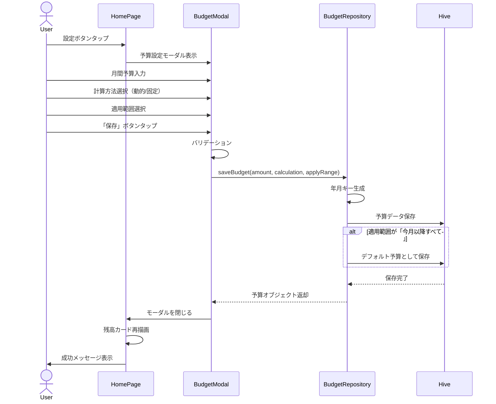
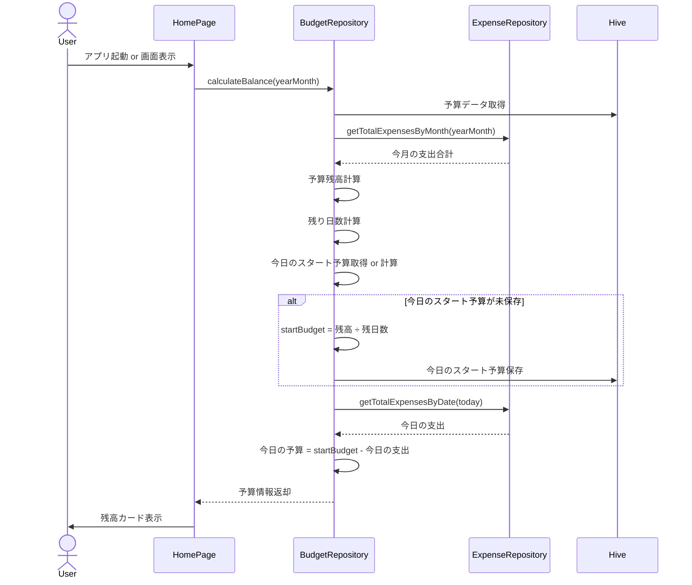

# 機能設計書

## 基本情報

### 機能名
予算管理機能

### 目的
月間予算を設定し、「今日使えるお金」を明確に可視化することで、計画的なやりくりをサポートする。

### この機能で実現すること
- 月間予算の設定（金額、適用範囲）
- 今日の予算の自動計算（動的計算 or 固定計算）
- 予算残高のリアルタイム表示
- 月別予算管理（過去・未来の月にも対応）
- 日別予算スタート値の記録

### ユーザー体験を良くするために実装すること
- 「今日使えるお金」の大きな表示による一目での把握
- 予算計算方法の選択（動的/固定）による柔軟性
- 適用範囲の選択（今月のみ/今月以降すべて）による設定の簡便化
- 予算残高の色分け表示（警告色など）
- 予算設定の簡単な変更

---

## 実装設計

### 1. 画面構成

#### ホーム画面（予算表示セクション）
- **残高カード**
  - 今月の予算（大きく表示）
  - 今月の支出
  - 予算残高
  - 今日の予算（最も大きく強調表示）
  - 残り日数表示

- **予算設定ボタン**
  - 設定アイコン
  - タップで予算設定モーダルを表示

#### 予算設定モーダル
- **お小遣い（月間予算）入力フィールド**（数値キーボード）
- **今日の予算の計算方法選択**
  - ラジオボタン：動的計算 / 固定計算
  - 説明文表示
- **変更の適用範囲選択**
  - ラジオボタン：今月のみ / 今月以降すべて
- **保存/キャンセルボタン**

### 2. Firebaseスキーマ定義
なし（ローカルDB使用）

### 3. Cloud Functions API設計
なし（ローカルアプリ）

### 4. 小機能一覧と実装内容

#### 4.1 予算の設定
- **月間予算の保存**
  - 入力: 金額（int）、計算方法（enum）、適用範囲（enum）
  - 処理: バリデーション、年月キーで保存、デフォルト予算設定（適用範囲に応じて）
  - 出力: 保存された予算オブジェクト

#### 4.2 今日の予算計算
- **動的計算**
  - 計算式: `(予算残高) ÷ (残り日数)`
  - 毎日0時に予算スタート値を保存
  - 今日の支出を減算してリアルタイム表示

- **固定計算**
  - 計算式: `(月間予算) ÷ (月の日数)`
  - 支出に関わらず固定額を表示

- **日別予算スタート値の管理**
  - 毎日最初のアクセス時に当日のスタート値を計算・保存
  - 過去30日分を保持（古いデータは自動削除）

#### 4.3 予算残高の計算
- **残高取得**
  - 計算式: `(月間予算) - (今月の支出合計)`
  - リアルタイム更新

#### 4.4 月別予算管理
- **予算の取得**
  - 指定月の予算を取得
  - 該当月に予算がない場合はデフォルト予算を返却
  - デフォルト予算もない場合はnull

- **月の日数・残り日数の計算**
  - 指定月の総日数を計算
  - 現在日からの残り日数を計算（過去の月は0）

### 5. 使用パッケージ
- `hive` / `hive_flutter` - ローカルデータベース
- `intl` - 日付フォーマット
- `provider` または `riverpod` - 状態管理
- `liquid_glass_renderer` - Glassmorphismデザイン

### 6. シーケンス図

#### 予算の設定


#### 今日の予算計算（動的）


---

## データモデル

### Budget（予算）

```dart
@HiveType(typeId: 1)
class Budget {
  @HiveField(0)
  final int amount; // 月間予算（円）

  @HiveField(1)
  final CalculationType calculation; // 計算方法

  @HiveField(2)
  final ApplyRange applyRange; // 適用範囲

  @HiveField(3)
  final DateTime createdAt; // 作成日時

  Budget({
    required this.amount,
    required this.calculation,
    required this.applyRange,
    required this.createdAt,
  });
}
```

### CalculationType（計算方法）

```dart
enum CalculationType {
  @HiveField(0)
  dynamic,  // 動的計算（残額÷残日数）

  @HiveField(1)
  fixed,    // 固定計算（予算÷月の日数）
}
```

### ApplyRange（適用範囲）

```dart
enum ApplyRange {
  @HiveField(0)
  currentMonth,  // 今月のみ

  @HiveField(1)
  future,        // 今月以降すべて
}
```

### DailyBudgetStart（日別予算スタート値）

```dart
@HiveType(typeId: 2)
class DailyBudgetStart {
  @HiveField(0)
  final String date; // 日付（YYYY-MM-DD）

  @HiveField(1)
  final int startBudget; // スタート予算

  @HiveField(2)
  final DateTime calculatedAt; // 計算日時

  DailyBudgetStart({
    required this.date,
    required this.startBudget,
    required this.calculatedAt,
  });
}
```

---

## プロトタイプ実装箇所（参照）

### ロジック
- `app.js`
  - `MoneyPouchApp.saveBudget()` - 予算保存
  - `MoneyPouchApp.getBudget()` - 予算取得
  - `MoneyPouchApp.getCurrentBudget()` - 現在月の予算取得
  - `MoneyPouchApp.calculateBalance()` - 残高計算
  - `MoneyPouchApp.getTodayBudgetStart()` - 今日のスタート予算取得
  - `MoneyPouchApp.getDaysInMonth()` - 月の日数取得
  - `MoneyPouchApp.getRemainingDaysInMonth()` - 残り日数取得

### UI
- `home.html`
  - 残高カード（予算表示）
  - 予算設定モーダル

---

## テストケース

### 単体テスト
- [ ] 予算の保存が正しく動作する
- [ ] 月別の予算取得が正しく動作する
- [ ] デフォルト予算が正しく適用される
- [ ] 予算残高の計算が正しい
- [ ] 動的計算の今日の予算が正しい
- [ ] 固定計算の今日の予算が正しい
- [ ] 月の日数計算が正しい
- [ ] 残り日数計算が正しい
- [ ] 今日のスタート予算が保存される
- [ ] 過去30日以前のスタート予算が削除される

### 統合テスト
- [ ] 予算設定後、残高カードに即座に反映される
- [ ] 支出登録後、今日の予算が減少する
- [ ] 日付が変わると、新しいスタート予算が計算される
- [ ] 「今月以降すべて」設定時、翌月にも適用される
- [ ] 計算方法を変更すると、今日の予算が再計算される

### UIテスト
- [ ] 予算設定モーダルが正しく表示される
- [ ] 残高カードが正しく表示される
- [ ] 今日の予算が最も目立つように表示される
- [ ] 計算方法のラジオボタンが正しく動作する
- [ ] 適用範囲のラジオボタンが正しく動作する
