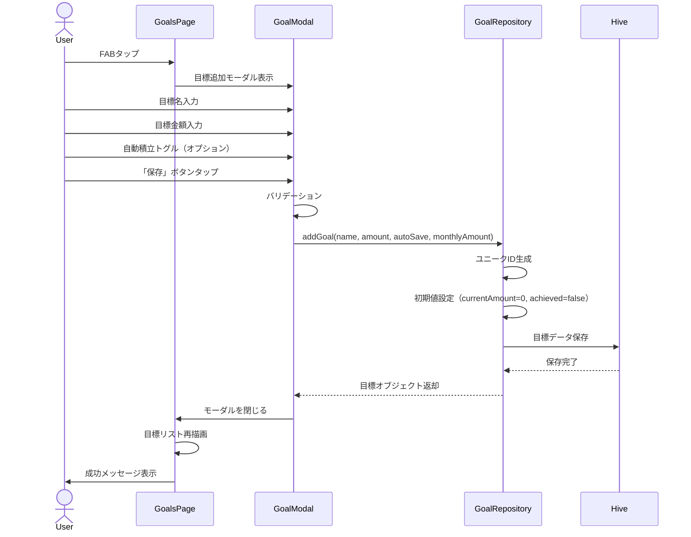
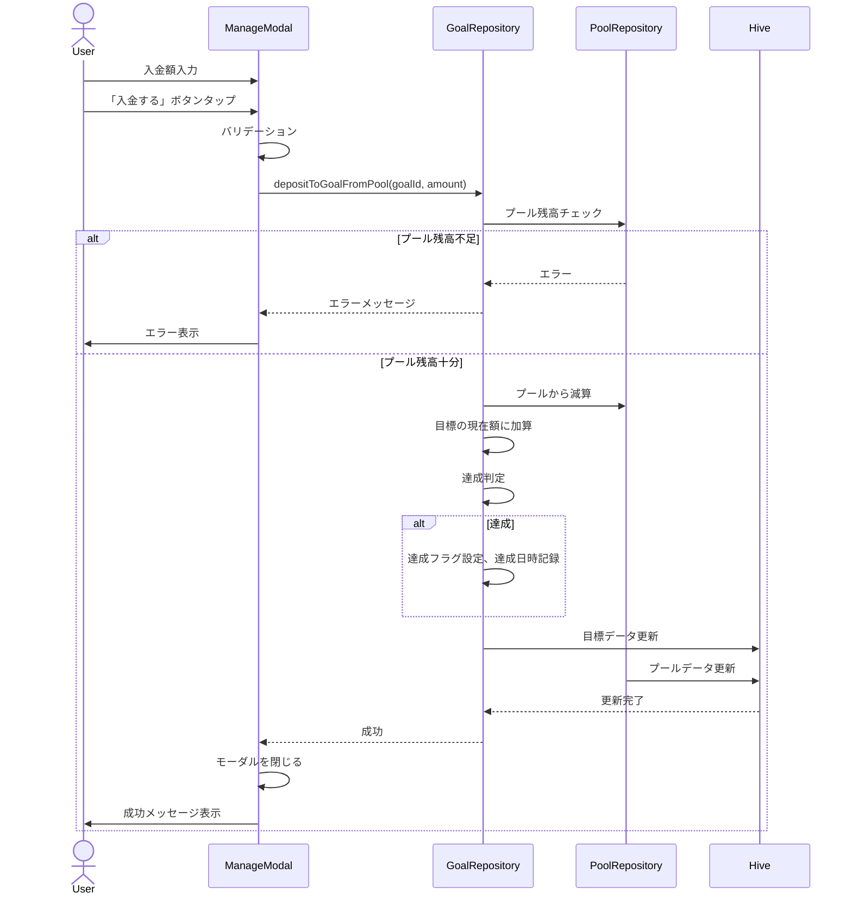

# 機能設計書

## 基本情報

### 機能名
貯蓄目標管理機能

### 目的
貯蓄目標を設定し、計画的に貯金することで、目標達成を視覚的にサポートする。

### この機能で実現すること
- 貯蓄目標のCRUD操作（作成、読み取り、更新、削除）
- 手動入金・減額（総貯蓄額プールとの連携）
- 自動達成判定（現在額 ≥ 目標額）
- 目標の進捗表示（プログレスバー、達成率）
- フィルタリング（すべて、未達成、達成済み）
- 目標の集計（総貯蓄額、達成数）

### ユーザー体験を良くするために実装すること
- プログレスバーによる視覚的な進捗表示
- 達成バッジ・アニメーションによる達成感の演出
- 目標カードのカラフルな表示
- 自動積立設定による手間の軽減
- ドラッグ&ドロップによる目標の並び替え（将来実装）

---

## 実装設計

### 1. 画面構成

#### 貯蓄目標画面
- **総貯蓄額プールカード**
  - 総貯蓄額（プール残高）
  - 目標への入金額合計
  - 貯蓄達成数

- **フィルターボタン**
  - すべて / 未達成 / 達成済み

- **目標カードリスト**
  - 目標名
  - 現在額 / 目標額
  - 進捗率（%）
  - プログレスバー
  - 残り金額（未達成時）
  - 達成バッジ・達成日（達成時）

- **フローティングアクションボタン**
  - タップで目標追加モーダルを表示

- **空の状態表示**
  - 目標がない場合のメッセージ
  - 「最初の貯蓄目標を追加」ボタン

#### 目標追加/編集モーダル
- **貯蓄目標名入力フィールド**
- **目標金額入力フィールド**（数値キーボード）
- **自動積立設定トグル**
  - ON時：月々の積立額入力フィールド表示
- **保存/キャンセルボタン**

#### 目標管理モーダル（詳細）
- **手動入金セクション**
  - 利用可能額表示（総貯蓄額プール）
  - 入金額入力フィールド
  - 入金ボタン

- **減額セクション**
  - 現在の入金額表示
  - 減額入力フィールド
  - 減額ボタン

- **編集セクション**
  - 目標名・目標金額の編集
  - 自動積立設定の変更

- **削除ボタン**

### 2. Firebaseスキーマ定義
なし（ローカルDB使用）

### 3. Cloud Functions API設計
なし（ローカルアプリ）

### 4. 小機能一覧と実装内容

#### 4.1 目標のCRUD操作
- **Create（作成）**
  - 入力: 目標名、目標金額、自動積立設定、月々の積立額
  - 処理: ユニークID生成、初期値設定（currentAmount=0）、Hive保存
  - 出力: 作成された目標オブジェクト

- **Read（読み取り）**
  - 全目標取得: `List<Goal> getAllGoals()`
  - キャッシュ機構により高速化

- **Update（更新）**
  - 入力: 目標ID、更新データ
  - 処理: バリデーション、達成判定、更新日時記録、Hive保存
  - 出力: 更新された目標オブジェクト

- **Delete（削除）**
  - 入力: 目標ID
  - 処理: 確認ダイアログ表示、Hiveから削除
  - 出力: 削除成功フラグ

#### 4.2 手動入金・減額
- **手動入金（総貯蓄額プールから）**
  - 入力: 目標ID、入金額
  - 処理: プール残高チェック、プールから減算、目標の現在額に加算、達成判定
  - 出力: 更新された目標とプール

- **減額（総貯蓄額プールへ返済）**
  - 入力: 目標ID、減額
  - 処理: 目標の現在額チェック、目標から減算、プールに加算、達成状態解除判定
  - 出力: 更新された目標とプール

#### 4.3 自動達成判定
- **達成判定**
  - 条件: `currentAmount >= amount`
  - 処理: 達成フラグ設定、達成日時記録

- **達成解除判定**
  - 条件: `currentAmount < amount` かつ 達成済み
  - 処理: 達成フラグクリア、達成日時クリア

#### 4.4 フィルタリング
- **フィルター適用**
  - すべて: 全目標を表示
  - 未達成: `achieved == false`
  - 達成済み: `achieved == true`

#### 4.5 集計
- **総貯蓄額計算**
  - 計算式: 全目標の`currentAmount`の合計

- **達成目標数カウント**
  - 計算式: `achieved == true`の目標数

- **月間積立額計算**
  - 計算式: `autoSave == true`かつ`achieved == false`の目標の`monthlyAmount`合計

### 5. 使用パッケージ
- `hive` / `hive_flutter` - ローカルデータベース
- `uuid` - ユニークID生成
- `provider` または `riverpod` - 状態管理
- `liquid_glass_renderer` - Glassmorphismデザイン
- `confetti` - 達成アニメーション（オプション）

### 6. シーケンス図

#### 目標の作成


#### 手動入金


---

## データモデル

### Goal（貯蓄目標）

```dart
@HiveType(typeId: 3)
class Goal {
  @HiveField(0)
  final String id;

  @HiveField(1)
  final String name; // 目標名

  @HiveField(2)
  final int amount; // 目標金額（円）

  @HiveField(3)
  final int currentAmount; // 現在の貯蓄額（円）

  @HiveField(4)
  final bool autoSave; // 自動積立設定

  @HiveField(5)
  final int monthlyAmount; // 月々の積立額（円）

  @HiveField(6)
  final DateTime createdAt; // 作成日時

  @HiveField(7)
  final bool achieved; // 達成フラグ

  @HiveField(8)
  final DateTime? achievedAt; // 達成日時

  @HiveField(9)
  final DateTime? updatedAt; // 更新日時

  Goal({
    required this.id,
    required this.name,
    required this.amount,
    this.currentAmount = 0,
    this.autoSave = false,
    this.monthlyAmount = 0,
    required this.createdAt,
    this.achieved = false,
    this.achievedAt,
    this.updatedAt,
  });

  // 進捗率を計算
  double get progressRate {
    if (amount == 0) return 0.0;
    return (currentAmount / amount).clamp(0.0, 1.0);
  }

  // 残り金額を計算
  int get remainingAmount {
    return (amount - currentAmount).clamp(0, amount);
  }
}
```

---

## プロトタイプ実装箇所（参照）

### ロジック
- `app.js`
  - `MoneyPouchApp.addGoal()` - 目標追加
  - `MoneyPouchApp.updateGoal()` - 目標更新
  - `MoneyPouchApp.deleteGoal()` - 目標削除
  - `MoneyPouchApp.getGoals()` - 全目標取得
  - `MoneyPouchApp.addToGoal()` - 目標に貯蓄額を追加
  - `MoneyPouchApp.getTotalSavings()` - 総貯蓄額計算
  - `MoneyPouchApp.getAchievedGoalsCount()` - 達成済み目標数取得
  - `MoneyPouchApp.depositToGoalFromPool()` - プールから目標へ入金
  - `MoneyPouchApp.withdrawFromGoalToPool()` - 目標からプールへ返済

### UI
- `goals.html`
  - 総貯蓄額プールカード
  - フィルターボタン
  - 目標カードリスト
  - 目標追加モーダル
  - 目標管理モーダル

---

## テストケース

### 単体テスト
- [ ] 目標の新規作成が正しく動作する
- [ ] 目標の更新が正しく動作する
- [ ] 目標の削除が正しく動作する
- [ ] 手動入金が正しく動作する
- [ ] 減額が正しく動作する
- [ ] 達成判定が正しく動作する
- [ ] 達成解除判定が正しく動作する
- [ ] 進捗率の計算が正しい
- [ ] 残り金額の計算が正しい
- [ ] 総貯蓄額の計算が正しい
- [ ] 達成目標数のカウントが正しい

### 統合テスト
- [ ] 目標作成後、リストに即座に反映される
- [ ] 入金後、進捗率が更新される
- [ ] 達成時、達成バッジが表示される
- [ ] 減額後、達成状態が解除される
- [ ] フィルター適用時、該当目標のみ表示される
- [ ] プール残高不足時、入金エラーが表示される

### UIテスト
- [ ] 目標追加モーダルが正しく表示される
- [ ] 目標管理モーダルが正しく表示される
- [ ] プログレスバーが正しく表示される
- [ ] 達成バッジが正しく表示される
- [ ] フィルターボタンが正しく動作する
- [ ] 削除確認ダイアログが表示される
