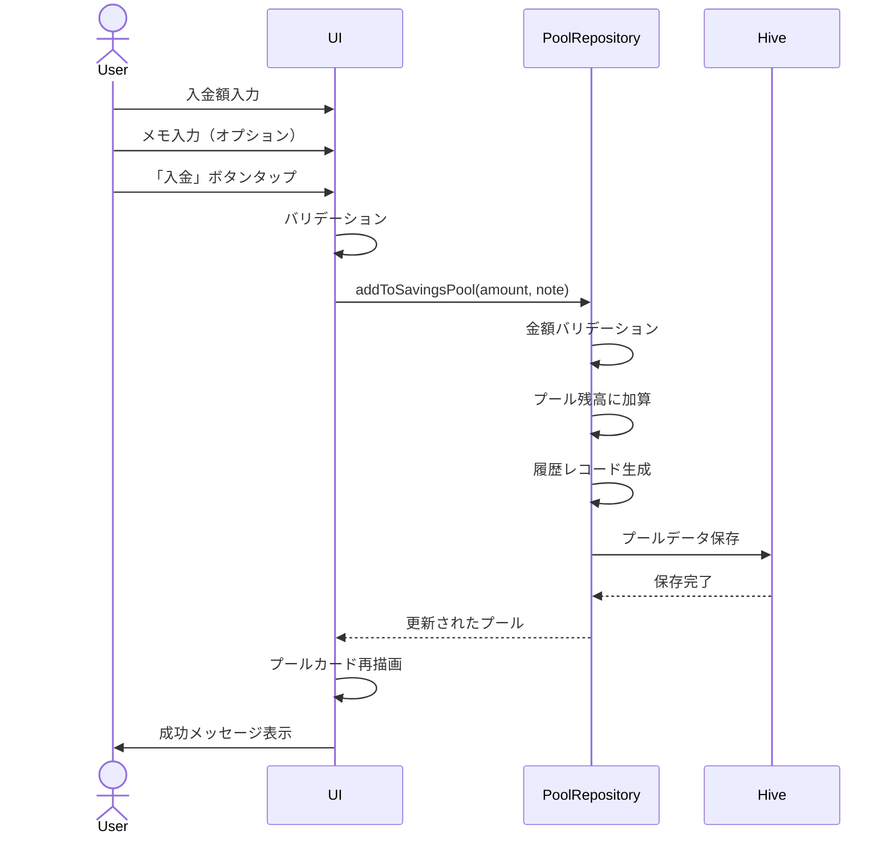
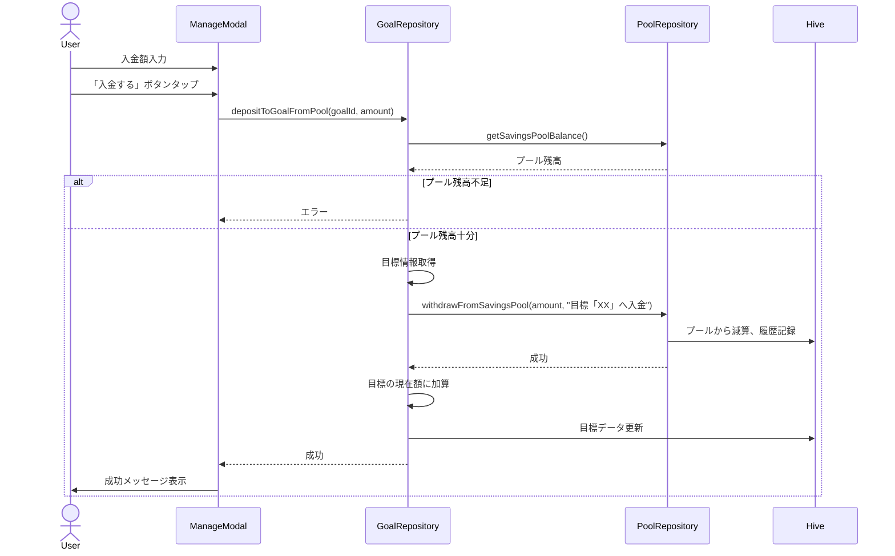

# 機能設計書

## 基本情報

### 機能名
総貯蓄額プール管理機能

### 目的
余剰金を一元管理し、貯蓄目標への入金や引き出しを履歴付きで管理することで、柔軟な資金管理を実現する。

### この機能で実現すること
- プール残高の管理
- プールへの入金・引き出し
- トランザクション履歴の記録（メモ付き）
- 貯蓄目標との資金移動
- プール残高の表示

### ユーザー体験を良くするために実装すること
- プール残高の大きな表示による可視化
- 履歴による資金の流れの把握
- メモ機能による用途の記録
- 目標への入金時の自動メモ生成

---

## 実装設計

### 1. 画面構成

#### 貯蓄目標画面（プールカード）
- **総貯蓄額プールカード**
  - プール残高（大きく表示）
  - 目標への入金額合計
  - 貯蓄達成数

#### プール履歴画面（将来実装）
- **履歴リスト**
  - 日付・時刻
  - 種類（入金/引き出し）
  - 金額
  - メモ
  - 残高

### 2. Firebaseスキーマ定義
なし（ローカルDB使用）

### 3. Cloud Functions API設計
なし（ローカルアプリ）

### 4. 小機能一覧と実装内容

#### 4.1 プール残高管理
- **残高取得**
  - 処理: Hiveからプールデータ取得
  - 出力: プール残高（int）

#### 4.2 プールへの入出金
- **入金**
  - 入力: 金額、メモ（オプション）
  - 処理: バリデーション、残高加算、履歴記録、Hive保存
  - 出力: 更新されたプールオブジェクト

- **引き出し**
  - 入力: 金額、メモ（オプション）
  - 処理: バリデーション、残高チェック、残高減算、履歴記録、Hive保存
  - 出力: 更新されたプールオブジェクト

#### 4.3 履歴管理
- **履歴記録**
  - ID生成
  - 種類（add/withdraw）
  - 金額
  - メモ
  - タイムスタンプ
  - 配列に追加

- **履歴取得**
  - 全履歴取得（時系列順）
  - 期間指定取得（将来実装）

#### 4.4 目標との連携
- **目標への入金**
  - 処理: プールから引き出し、メモに「目標「○○」へ入金」を自動設定
  - 目標の現在額に加算

- **目標からの返済**
  - 処理: 目標から減算、プールに入金、メモに「目標「○○」から返済」を自動設定

### 5. 使用パッケージ
- `hive` / `hive_flutter` - ローカルデータベース
- `uuid` - ユニークID生成
- `provider` または `riverpod` - 状態管理
- `liquid_glass_renderer` - Glassmorphismデザイン

### 6. シーケンス図

#### プールへの入金


#### 目標への入金（プールから）


---

## データモデル

### SavingsPool（総貯蓄額プール）

```dart
@HiveType(typeId: 4)
class SavingsPool {
  @HiveField(0)
  int amount; // プール残高（円）

  @HiveField(1)
  List<PoolTransaction> history; // 履歴

  SavingsPool({
    this.amount = 0,
    List<PoolTransaction>? history,
  }) : history = history ?? [];
}
```

### PoolTransaction（プール履歴）

```dart
@HiveType(typeId: 5)
class PoolTransaction {
  @HiveField(0)
  final String id;

  @HiveField(1)
  final int amount; // 金額（円）

  @HiveField(2)
  final TransactionType type; // 種類（add/withdraw）

  @HiveField(3)
  final String note; // メモ

  @HiveField(4)
  final DateTime timestamp; // 日時

  PoolTransaction({
    required this.id,
    required this.amount,
    required this.type,
    this.note = '',
    required this.timestamp,
  });
}
```

### TransactionType（履歴種別）

```dart
enum TransactionType {
  @HiveField(0)
  add,      // 入金

  @HiveField(1)
  withdraw, // 引き出し
}
```

---

## プロトタイプ実装箇所（参照）

### ロジック
- `app.js`
  - `MoneyPouchApp.getSavingsPool()` - プール取得
  - `MoneyPouchApp.getSavingsPoolBalance()` - プール残高取得
  - `MoneyPouchApp.addToSavingsPool()` - プールに入金
  - `MoneyPouchApp.withdrawFromSavingsPool()` - プールから引き出し
  - `MoneyPouchApp.depositToGoalFromPool()` - プールから目標へ入金
  - `MoneyPouchApp.withdrawFromGoalToPool()` - 目標からプールへ返済

### UI
- `goals.html`
  - 総貯蓄額プールカード

---

## テストケース

### 単体テスト
- [ ] プールへの入金が正しく動作する
- [ ] プールからの引き出しが正しく動作する
- [ ] プール残高不足時にエラーが発生する
- [ ] 履歴が正しく記録される
- [ ] 目標への入金時にメモが自動生成される
- [ ] 目標からの返済時にメモが自動生成される

### 統合テスト
- [ ] 入金後、プール残高が増加する
- [ ] 引き出し後、プール残高が減少する
- [ ] 目標への入金後、プール残高が減少し目標額が増加する
- [ ] 目標からの返済後、プール残高が増加し目標額が減少する

### UIテスト
- [ ] プールカードが正しく表示される
- [ ] プール残高が正しく表示される
- [ ] 履歴リストが正しく表示される（将来実装）
