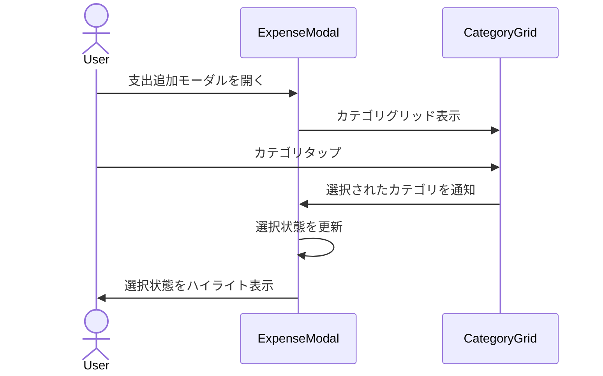

# 機能設計書

## 基本情報

### 機能名
カテゴリ管理機能

### 目的
支出を6種類のカテゴリで分類し、アイコンとカラーで視覚的に識別できるようにする。

### この機能で実現すること
- 6種類のカテゴリ定義（食費、娯楽、交通費、買い物、医療、その他）
- カテゴリアイコンの表示（Material Icons）
- カテゴリカラーの表示（全テーマ共通）
- カテゴリ選択UI（グリッド表示）

### ユーザー体験を良くするために実装すること
- アイコンによる視覚的な識別
- カラーによる素早い認識
- グリッド表示による一覧性
- 将来的なカスタムカテゴリ対応の設計

---

## 実装設計

### 1. 画面構成

#### カテゴリ選択グリッド
- **3×2のグリッドレイアウト**
  - カテゴリアイコン
  - カテゴリ名
  - 選択状態の表示

### 2. Firebaseスキーマ定義
なし（固定値として定義）

### 3. Cloud Functions API設計
なし（ローカルアプリ）

### 4. 小機能一覧と実装内容

#### 4.1 カテゴリ定義
- **Enumとしての定義**
  ```dart
  enum Category {
    food,        // 食費
    entertainment, // 娯楽
    transport,   // 交通費
    shopping,    // 買い物
    health,      // 医療
    other,       // その他
  }
  ```

#### 4.2 カテゴリメタデータ
- **名前・アイコン・カラーの定義**
  - 各カテゴリのメタデータをMap/Classで管理
  - 拡張可能な設計

#### 4.3 カテゴリ選択UI
- **グリッドビルダー**
  - 3列のグリッド表示
  - タップ選択
  - 選択状態のハイライト

### 5. 使用パッケージ
- なし（Flutter標準機能）

### 6. シーケンス図

#### カテゴリ選択


---

## データモデル

### Category（カテゴリEnum）

```dart
enum Category {
  food,
  entertainment,
  transport,
  shopping,
  health,
  other,
}
```

### CategoryMetadata（カテゴリメタデータ）

```dart
class CategoryMetadata {
  final Category category;
  final String name;
  final IconData icon;
  final Color backgroundColor;
  final Color iconColor;

  const CategoryMetadata({
    required this.category,
    required this.name,
    required this.icon,
    required this.backgroundColor,
    required this.iconColor,
  });

  // 全カテゴリのメタデータマップ
  static const Map<Category, CategoryMetadata> all = {
    Category.food: CategoryMetadata(
      category: Category.food,
      name: '食費',
      icon: Icons.restaurant,
      backgroundColor: Color(0x80FFB74D), // オレンジ系
      iconColor: Color(0xFFFFE4B3),
    ),
    Category.entertainment: CategoryMetadata(
      category: Category.entertainment,
      name: '娯楽',
      icon: Icons.sports_esports,
      backgroundColor: Color(0x80818CF8), // 青紫系
      iconColor: Color(0xFFC7CCFC),
    ),
    Category.transport: CategoryMetadata(
      category: Category.transport,
      name: '交通費',
      icon: Icons.directions_bus,
      backgroundColor: Color(0x804ADE80), // 緑系
      iconColor: Color(0xFFC0F5D5),
    ),
    Category.shopping: CategoryMetadata(
      category: Category.shopping,
      name: '買い物',
      icon: Icons.shopping_bag,
      backgroundColor: Color(0x80F472B6), // ピンク系
      iconColor: Color(0xFFFCC9E6),
    ),
    Category.health: CategoryMetadata(
      category: Category.health,
      name: '医療',
      icon: Icons.favorite,
      backgroundColor: Color(0x80F87171), // 赤系
      iconColor: Color(0xFFFDC7C7),
    ),
    Category.other: CategoryMetadata(
      category: Category.other,
      name: 'その他',
      icon: Icons.more_horiz,
      backgroundColor: Color(0x809CA3AF), // グレー系
      iconColor: Color(0xFFDFE2E6),
    ),
  };
}
```

---

## プロトタイプ実装箇所（参照）

### 定義
- `js/constants.js`
  - `CONSTANTS.CATEGORIES` - カテゴリ定義

### スタイル
- `css/variables.css`
  - `--category-*-bg` - カテゴリ背景色
  - `--category-*-icon` - カテゴリアイコン色

---

## テストケース

### 単体テスト
- [ ] 全カテゴリのメタデータが正しく定義されている
- [ ] カテゴリEnumが正しく動作する

### 統合テスト
- [ ] カテゴリ選択UIが正しく動作する
- [ ] 選択したカテゴリが支出に正しく保存される

### UIテスト
- [ ] カテゴリグリッドが正しく表示される
- [ ] カテゴリアイコンが正しく表示される
- [ ] カテゴリカラーが正しく表示される
- [ ] 選択状態が正しくハイライトされる
