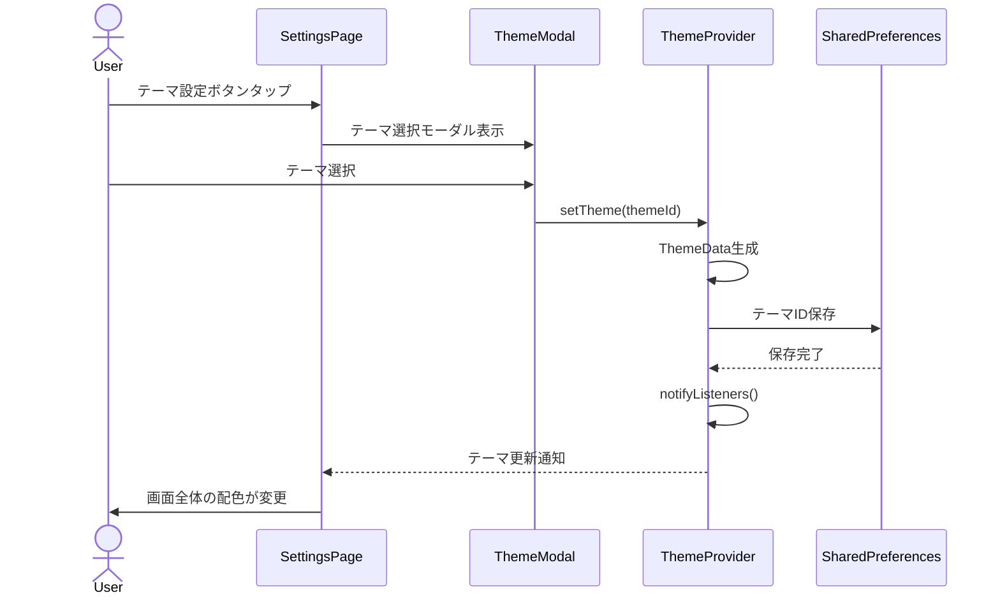
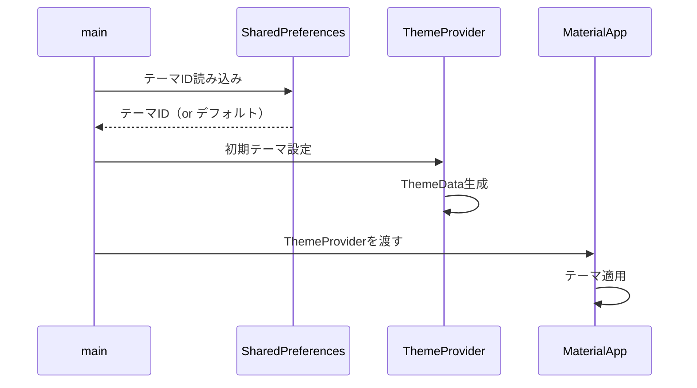

# 機能設計書

## 基本情報

### 機能名
テーマ・外観管理機能

### 目的
3種類のテーマを提供し、ユーザーの好みに合わせてアプリ全体の配色を変更できるようにする。

### この機能で実現すること
- 3種類のテーマ管理（デフォルト、ミッドナイト、ハッカー）
- テーマ選択モーダル
- テーマの永続化（SharedPreferences）
- アプリ全体へのテーマ適用
- FOUC対策（起動時の即座適用）

### ユーザー体験を良くするために実装すること
- テーマ選択の即座反映
- テーマプレビュー（将来実装）
- ダークモード対応の検討
- カスタムテーマ作成機能（将来実装）

---

## 実装設計

### 1. 画面構成

#### 設定ドロワー/設定画面
- **テーマカラー設定セクション**
  - 現在のテーマ表示
  - テーマ選択ボタン

#### テーマ選択モーダル
- **テーマオプションリスト**
  - テーマアイコン
  - テーマ名
  - 選択中マーク

### 2. Firebaseスキーマ定義
なし（ローカル設定）

### 3. Cloud Functions API設計
なし（ローカルアプリ）

### 4. 小機能一覧と実装内容

#### 4.1 テーマ定義
- **3種類のテーマ**
  - デフォルト: 青紫グラデーション、エメラルドグリーン
  - ミッドナイト: 黒×ダークブルー、スカイブルー
  - ハッカー: 純黒、ターミナル緑

- **ThemeDataの定義**
  - 背景グラデーション
  - プライマリカラー
  - テキストカラー
  - カードカラー

#### 4.2 テーマの切り替え
- **テーマ適用**
  - 入力: テーマID
  - 処理: ThemeDataを生成、Providerで通知、SharedPreferencesに保存
  - 出力: なし（状態更新）

#### 4.3 テーマの永続化
- **保存**
  - SharedPreferencesにテーマIDを保存

- **読み込み**
  - アプリ起動時にSharedPreferencesからテーマIDを読み込み
  - 該当するThemeDataを適用

#### 4.4 FOUC対策
- **起動時の即座適用**
  - main()でSharedPreferencesから読み込み
  - MaterialAppのtheme/darkThemeに即座に設定

### 5. 使用パッケージ
- `shared_preferences` - テーマ設定の永続化
- `provider` または `riverpod` - 状態管理

### 6. シーケンス図

#### テーマの切り替え


#### アプリ起動時のテーマ読み込み


---

## データモデル

### ThemeType（テーマEnum）

```dart
enum ThemeType {
  defaultTheme,
  midnight,
  terminal,
}
```

### AppTheme（テーマクラス）

```dart
class AppTheme {
  final ThemeType type;
  final String name;
  final IconData icon;
  final ThemeData themeData;

  const AppTheme({
    required this.type,
    required this.name,
    required this.icon,
    required this.themeData,
  });

  // 全テーマのリスト
  static final List<AppTheme> all = [
    AppTheme(
      type: ThemeType.defaultTheme,
      name: 'デフォルト',
      icon: Icons.computer,
      themeData: _buildDefaultTheme(),
    ),
    AppTheme(
      type: ThemeType.midnight,
      name: 'ミッドナイト',
      icon: Icons.nights_stay,
      themeData: _buildMidnightTheme(),
    ),
    AppTheme(
      type: ThemeType.terminal,
      name: 'ハッカー',
      icon: Icons.terminal,
      themeData: _buildTerminalTheme(),
    ),
  ];

  static ThemeData _buildDefaultTheme() {
    return ThemeData(
      brightness: Brightness.dark,
      primaryColor: const Color(0xFF10b981), // エメラルドグリーン
      scaffoldBackgroundColor: Colors.transparent,
      // ...その他の設定
    );
  }

  static ThemeData _buildMidnightTheme() {
    return ThemeData(
      brightness: Brightness.dark,
      primaryColor: const Color(0xFF38bdf8), // スカイブルー
      scaffoldBackgroundColor: Colors.transparent,
      // ...その他の設定
    );
  }

  static ThemeData _buildTerminalTheme() {
    return ThemeData(
      brightness: Brightness.dark,
      primaryColor: const Color(0xFF00ff41), // ターミナル緑
      scaffoldBackgroundColor: Colors.black,
      // ...その他の設定
    );
  }
}
```

---

## プロトタイプ実装箇所（参照）

### ロジック
- `js/theme.js` - テーマ管理
- `js/theme-init.js` - テーマ初期化

### スタイル定義
- `css/variables.css` - CSS変数によるテーマ定義

---

## テストケース

### 単体テスト
- [ ] テーマの切り替えが正しく動作する
- [ ] テーマがSharedPreferencesに保存される
- [ ] テーマがSharedPreferencesから読み込まれる
- [ ] デフォルトテーマが正しく適用される

### 統合テスト
- [ ] テーマ切り替え後、アプリ全体の配色が変わる
- [ ] アプリ再起動後もテーマが維持される

### UIテスト
- [ ] テーマ選択モーダルが正しく表示される
- [ ] テーマアイコンが正しく表示される
- [ ] 選択中マークが正しく表示される
- [ ] テーマ切り替えが即座に反映される
