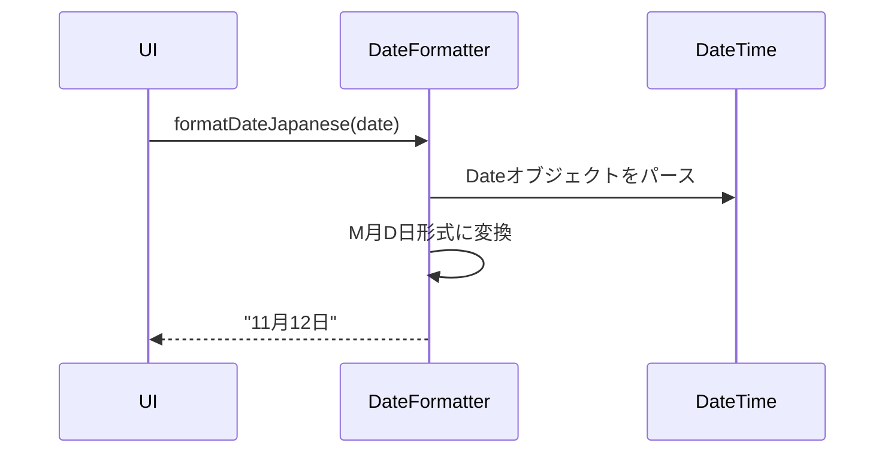

# 機能設計書

## 基本情報

### 機能名
日付・時刻管理機能

### 目的
日付の取得、計算、フォーマット変換を行い、アプリ全体で統一的な日付処理を提供する。

### この機能で実現すること
- 日付取得（現在の年月、今日の日付）
- 日付計算（月の日数、残り日数）
- 日付フォーマット（YYYY-MM-DD、M月D日、曜日）
- 時刻表示（HH:MM）
- タイムゾーン処理

### ユーザー体験を良くするために実装すること
- 統一されたフォーマット表示
- 日本語での日付表示
- 曜日の表示
- 相対時刻表示（将来実装：「3時間前」など）

---

## 実装設計

### 1. 画面構成
なし（ユーティリティ機能）

### 2. Firebaseスキーマ定義
なし

### 3. Cloud Functions API設計
なし

### 4. 小機能一覧と実装内容

#### 4.1 日付取得
- **現在の年月取得**
  - 出力: YYYY-MM形式の文字列
  - 例: "2025-11"

- **今日の日付取得**
  - 出力: YYYY-MM-DD形式の文字列
  - 例: "2025-11-12"

- **現在のDateTime取得**
  - 出力: DateTime オブジェクト

#### 4.2 日付計算
- **月の日数計算**
  - 入力: YYYY-MM形式の年月
  - 処理: Dateクラスで月末日を計算
  - 出力: 日数（int）

- **残り日数計算**
  - 入力: YYYY-MM形式の年月
  - 処理: 今日から月末までの日数（今日を含む）
  - 出力: 日数（int）
  - 過去の月は0を返す

- **日数差分計算**
  - 入力: 開始日、終了日
  - 出力: 日数差分（int）

#### 4.3 日付フォーマット
- **YYYY-MM-DD形式**
  - DateTimeを文字列に変換

- **M月D日形式**
  - 日本語形式の日付表示
  - 例: "11月12日"

- **M月D日（曜日）形式**
  - 曜日付きの日本語形式
  - 例: "11月12日（火）"

- **曜日取得**
  - 日〜土の曜日を返す

#### 4.4 時刻表示
- **HH:MM形式**
  - タイムスタンプから時刻を抽出
  - 例: "14:30"

- **HH:MM:SS形式**
  - 秒付きの時刻表示
  - 例: "14:30:45"

#### 4.5 タイムゾーン処理
- **JSTへの変換**
  - UTC → JSTへの変換
  - タイムゾーン対応

### 5. 使用パッケージ
- `intl` - 日付・時刻のフォーマット

### 6. シーケンス図

#### 日付フォーマット処理


---

## データモデル

### DateFormatter（ユーティリティクラス）

```dart
import 'package:intl/intl.dart';

class DateFormatter {
  // 現在の年月を取得（YYYY-MM）
  static String getCurrentYearMonth() {
    final now = DateTime.now();
    return DateFormat('yyyy-MM').format(now);
  }

  // 今日の日付を取得（YYYY-MM-DD）
  static String getToday() {
    final now = DateTime.now();
    return DateFormat('yyyy-MM-dd').format(now);
  }

  // 月の日数を計算
  static int getDaysInMonth(String yearMonth) {
    final parts = yearMonth.split('-');
    final year = int.parse(parts[0]);
    final month = int.parse(parts[1]);
    return DateTime(year, month + 1, 0).day;
  }

  // 残り日数を計算
  static int getRemainingDaysInMonth(String yearMonth) {
    final now = DateTime.now();
    final currentYearMonth = getCurrentYearMonth();

    if (yearMonth.compareTo(currentYearMonth) < 0) {
      return 0; // 過去の月
    }

    if (yearMonth.compareTo(currentYearMonth) > 0) {
      return getDaysInMonth(yearMonth); // 未来の月
    }

    // 今月
    final lastDay = getDaysInMonth(yearMonth);
    final today = now.day;
    return lastDay - today + 1;
  }

  // M月D日形式
  static String formatDateJapanese(String dateStr) {
    final date = DateTime.parse(dateStr);
    return '${date.month}月${date.day}日';
  }

  // M月D日（曜日）形式
  static String formatDateWithWeekday(String dateStr) {
    final date = DateTime.parse(dateStr);
    final weekdays = ['日', '月', '火', '水', '木', '金', '土'];
    final weekday = weekdays[date.weekday % 7];
    return '${date.month}月${date.day}日（$weekday）';
  }

  // HH:MM形式
  static String formatTime(DateTime dateTime) {
    return DateFormat('HH:mm').format(dateTime);
  }

  // YYYY-MM-DD形式
  static String formatDate(DateTime dateTime) {
    return DateFormat('yyyy-MM-dd').format(dateTime);
  }
}
```

---

## プロトタイプ実装箇所（参照）

### ロジック
- `app.js`
  - `MoneyPouchApp.getCurrentYearMonth()` - 現在の年月取得
  - `MoneyPouchApp.getDaysInMonth()` - 月の日数取得
  - `MoneyPouchApp.getRemainingDaysInMonth()` - 残り日数取得
  - `MoneyPouchApp.formatDate()` - YYYY-MM-DD形式
  - `MoneyPouchApp.formatDateJapanese()` - M月D日形式

---

## テストケース

### 単体テスト
- [ ] 現在の年月取得が正しい
- [ ] 今日の日付取得が正しい
- [ ] 月の日数計算が正しい（各月、うるう年）
- [ ] 残り日数計算が正しい（今月、過去、未来）
- [ ] M月D日形式のフォーマットが正しい
- [ ] 曜日取得が正しい
- [ ] HH:MM形式のフォーマットが正しい

### 統合テスト
- [ ] フォーマットされた日付が画面に正しく表示される
- [ ] 残り日数が予算計算に正しく使用される
