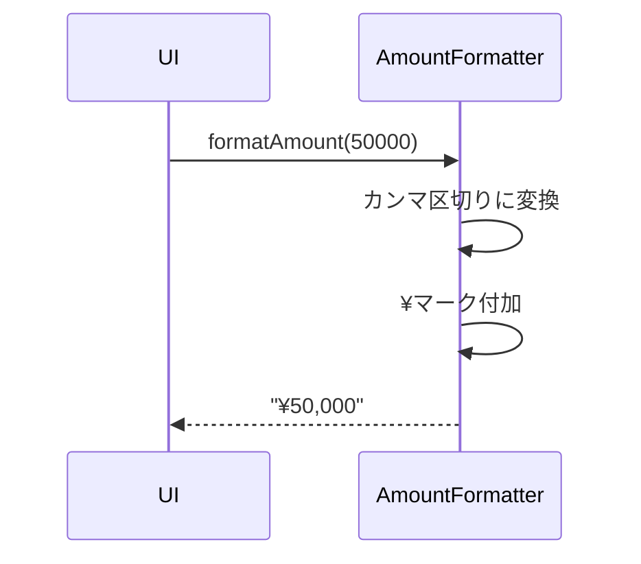

# 機能設計書

## 基本情報

### 機能名
金額処理機能

### 目的
金額のフォーマット表示と計算処理を提供する。

### この機能で実現すること
- 金額フォーマット（カンマ区切り、通貨記号）
- 金額計算（整数変換、合計計算）
- 金額の検証

### ユーザー体験を良くするために実装すること
- 見やすい金額表示
- 通貨記号による明確な表示
- 大きな金額でも読みやすいカンマ区切り

---

## 実装設計

### 1. 画面構成
なし（ユーティリティ機能）

### 2. Firebaseスキーマ定義
なし

### 3. Cloud Functions API設計
なし

### 4. 小機能一覧と実装内容

#### 4.1 金額フォーマット
- **カンマ区切り表示**
  - 3桁ごとにカンマを挿入
  - 例: 1000000 → "1,000,000"

- **通貨記号付き表示**
  - ¥マークを前置
  - 例: 1000000 → "¥1,000,000"

#### 4.2 金額計算
- **整数変換**
  - 文字列 or double → int
  - 小数点以下切り捨て

- **合計計算**
  - 配列の金額合計
  - List<int> → int

#### 4.3 金額の検証
- **正の整数チェック**
  - 0以上の整数か確認

### 5. 使用パッケージ
- `intl` - NumberFormat

### 6. シーケンス図

#### 金額フォーマット処理


---

## データモデル

### AmountFormatter（ユーティリティクラス）

```dart
import 'package:intl/intl.dart';

class AmountFormatter {
  // 通貨記号付きフォーマット
  static String formatAmount(int amount) {
    final formatter = NumberFormat('#,###', 'ja_JP');
    return '¥${formatter.format(amount)}';
  }

  // カンマ区切りのみ
  static String formatNumber(int amount) {
    final formatter = NumberFormat('#,###', 'ja_JP');
    return formatter.format(amount);
  }

  // 文字列 → int変換
  static int parseAmount(String amountStr) {
    // カンマと¥を削除
    final cleaned = amountStr.replaceAll(RegExp(r'[¥,]'), '');
    return int.tryParse(cleaned) ?? 0;
  }

  // double → int変換（切り捨て）
  static int toInt(double amount) {
    return amount.floor();
  }

  // 合計計算
  static int sum(List<int> amounts) {
    return amounts.fold(0, (sum, amount) => sum + amount);
  }

  // 正の整数チェック
  static bool isValidAmount(int amount) {
    return amount >= 0;
  }
}
```

---

## プロトタイプ実装箇所（参照）

### ロジック
- `app.js`
  - `MoneyPouchApp.formatAmount()` - 金額フォーマット
  - `MoneyPouchApp.validateAmount()` - 金額バリデーション

---

## テストケース

### 単体テスト
- [ ] formatAmount()が正しく動作する
- [ ] カンマ区切りが正しい
- [ ] 通貨記号が正しく付加される
- [ ] parseAmount()が正しく動作する
- [ ] 合計計算が正しい
- [ ] 金額バリデーションが正しい

### 統合テスト
- [ ] フォーマットされた金額が画面に正しく表示される
