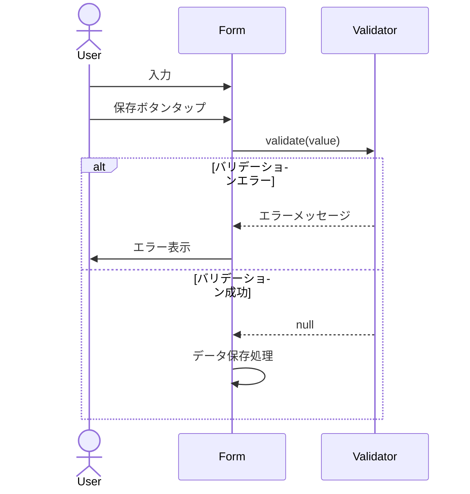

# 機能設計書

## 基本情報

### 機能名
バリデーション機能

### 目的
ユーザー入力のバリデーションを行い、不正なデータの登録を防ぐ。

### この機能で実現すること
- 金額バリデーション（0円〜1000万円）
- カテゴリバリデーション（存在チェック）
- 日付バリデーション（有効性チェック）
- 文字列バリデーション（空文字チェック、長さチェック）

### ユーザー体験を良くするために実装すること
- わかりやすいエラーメッセージ
- 入力フィールドへのフォーカス
- リアルタイムバリデーション
- 視覚的なエラー表示

---

## 実装設計

### 1. 画面構成
なし（ユーティリティ機能）

### 2. Firebaseスキーマ定義
なし

### 3. Cloud Functions API設計
なし

### 4. 小機能一覧と実装内容

#### 4.1 金額バリデーション
- **範囲チェック**
  - 最小値: 0円
  - 最大値: 10,000,000円（1000万円）
  - エラーメッセージ: 「金額は0以上1000万円以下で入力してください」

- **数値チェック**
  - NaN判定
  - エラーメッセージ: 「有効な金額を入力してください」

#### 4.2 カテゴリバリデーション
- **存在チェック**
  - 定義済みカテゴリか確認
  - エラーメッセージ: 「無効なカテゴリです」

#### 4.3 日付バリデーション
- **有効性チェック**
  - 有効な日付文字列か確認
  - エラーメッセージ: 「無効な日付です」

- **範囲チェック（オプション）**
  - 過去の日付のみ許可など

#### 4.4 文字列バリデーション
- **空文字チェック**
  - エラーメッセージ: 「○○を入力してください」

- **長さチェック**
  - 最大文字数チェック
  - エラーメッセージ: 「○○は△文字以内で入力してください」

### 5. 使用パッケージ
なし（Flutter標準機能）

### 6. シーケンス図

#### フォームバリデーション


---

## データモデル

### Validator（ユーティリティクラス）

```dart
class Validator {
  // 定数
  static const int MIN_AMOUNT = 0;
  static const int MAX_AMOUNT = 10000000; // 1000万円
  static const int MAX_NAME_LENGTH = 50;

  // 金額バリデーション
  static String? validateAmount(String? value) {
    if (value == null || value.isEmpty) {
      return '金額を入力してください';
    }

    final amount = int.tryParse(value);
    if (amount == null) {
      return '有効な金額を入力してください';
    }

    if (amount < MIN_AMOUNT) {
      return '金額は0以上で入力してください';
    }

    if (amount > MAX_AMOUNT) {
      return '金額は1000万円以下で入力してください';
    }

    return null; // バリデーション成功
  }

  // 文字列バリデーション（必須）
  static String? validateRequired(String? value, String fieldName) {
    if (value == null || value.trim().isEmpty) {
      return '$fieldNameを入力してください';
    }
    return null;
  }

  // 文字列長さバリデーション
  static String? validateLength(
    String? value,
    String fieldName,
    int maxLength,
  ) {
    if (value != null && value.length > maxLength) {
      return '$fieldNameは$maxLength文字以内で入力してください';
    }
    return null;
  }

  // 複合バリデーション（必須 + 長さ）
  static String? validateName(String? value, String fieldName) {
    final requiredError = validateRequired(value, fieldName);
    if (requiredError != null) return requiredError;

    final lengthError = validateLength(value, fieldName, MAX_NAME_LENGTH);
    if (lengthError != null) return lengthError;

    return null;
  }

  // 日付バリデーション
  static String? validateDate(String? value) {
    if (value == null || value.isEmpty) {
      return '日付を選択してください';
    }

    try {
      DateTime.parse(value);
      return null;
    } catch (e) {
      return '無効な日付です';
    }
  }

  // カテゴリバリデーション
  static String? validateCategory(Category? category) {
    if (category == null) {
      return 'カテゴリを選択してください';
    }
    return null;
  }
}
```

### Form使用例

```dart
TextFormField(
  validator: (value) => Validator.validateAmount(value),
  decoration: InputDecoration(
    labelText: '金額',
    errorMaxLines: 2,
  ),
)
```

---

## プロトタイプ実装箇所（参照）

### ロジック
- `app.js`
  - `MoneyPouchApp.validateAmount()` - 金額バリデーション
  - `MoneyPouchApp.validateCategory()` - カテゴリバリデーション
  - `MoneyPouchApp.validateDate()` - 日付バリデーション

### UI
- `home.html`, `goals.html`
  - フォームバリデーション

---

## テストケース

### 単体テスト
- [ ] 金額バリデーションが正しく動作する（正常値）
- [ ] 金額バリデーションが正しく動作する（0円）
- [ ] 金額バリデーションが正しく動作する（上限値）
- [ ] 金額バリデーションがエラーを返す（負の値）
- [ ] 金額バリデーションがエラーを返す（上限超過）
- [ ] 金額バリデーションがエラーを返す（NaN）
- [ ] 文字列バリデーションが正しく動作する
- [ ] 日付バリデーションが正しく動作する
- [ ] カテゴリバリデーションが正しく動作する

### 統合テスト
- [ ] フォーム送信時にバリデーションが実行される
- [ ] バリデーションエラー時に保存されない
- [ ] エラーメッセージが正しく表示される
