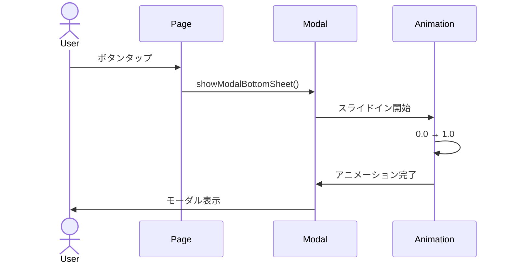

# 機能設計書

## 基本情報

### 機能名
UI/UX機能

### 目的
Glassmorphismデザイン、アニメーション、アクセシビリティにより優れたUXを提供する。

### この機能で実現すること
- Glassmorphismデザイン（liquid_glass_renderer）
- モーダル・ボトムシート管理
- アクセシビリティ対応（Semantics）
- アニメーション（Hero、フェード、スライド）
- レスポンシブデザイン
- ボトムナビゲーション
- ドロワー（設定）

### ユーザー体験を良くするために実装すること
- 美しいガラスモーフィズムデザイン
- スムーズなアニメーション
- 直感的な操作
- アクセシビリティ対応
- ダークモード対応

---

## 実装設計

### 1. 画面構成

#### 共通レイアウト
- **背景グラデーション**
  - テーマに応じた4段階グラデーション

- **Glassmorphismカード**
  - ぼかし効果（60-80px）
  - 半透明背景
  - 光沢境界線

#### ボトムナビゲーション
- **3画面切り替え**
  - ホーム、履歴、貯蓄
  - アクティブ状態表示
  - Glassmorphismスタイル

#### モーダル/ボトムシート
- **アニメーション**
  - スライドイン/アウト
  - フェードイン/アウト
  - スケールアニメーション

### 2. Firebaseスキーマ定義
なし

### 3. Cloud Functions API設計
なし

### 4. 小機能一覧と実装内容

#### 4.1 Glassmorphismデザイン
- **liquid_glass_rendererの使用**
  - LiquidGlassContainer
  - ぼかし強度の調整
  - 背景色の透明度

#### 4.2 アニメーション
- **Heroアニメーション**
  - 画面遷移時の要素移動

- **フェードアニメーション**
  - 表示/非表示のフェード

- **スライドアニメーション**
  - モーダル、ドロワーのスライド

- **スケールアニメーション**
  - ボタンのタップフィードバック

#### 4.3 アクセシビリティ
- **Semanticsウィジェット**
  - スクリーンリーダー対応
  - label, hint, value設定

- **コントラスト比**
  - WCAG AA基準準拠

- **タッチターゲットサイズ**
  - 最低44x44px

#### 4.4 レスポンシブデザイン
- **LayoutBuilder**
  - 画面サイズに応じたレイアウト変更

- **MediaQuery**
  - 画面幅、高さの取得

### 5. 使用パッケージ
- `liquid_glass_renderer` - Glassmorphism
- `flutter_animate` - アニメーション（オプション）

### 6. シーケンス図

#### モーダル表示アニメーション


---

## データモデル

### GlassCard（カスタムウィジェット例）

```dart
import 'package:flutter/material.dart';
import 'package:liquid_glass_renderer/liquid_glass_renderer.dart';

class GlassCard extends StatelessWidget {
  final Widget child;
  final double? width;
  final double? height;
  final EdgeInsetsGeometry? padding;
  final EdgeInsetsGeometry? margin;
  final double borderRadius;
  final double blurStrength;

  const GlassCard({
    super.key,
    required this.child,
    this.width,
    this.height,
    this.padding,
    this.margin,
    this.borderRadius = 20,
    this.blurStrength = 60,
  });

  @override
  Widget build(BuildContext context) {
    return Container(
      width: width,
      height: height,
      margin: margin,
      child: LiquidGlassContainer(
        borderRadius: BorderRadius.circular(borderRadius),
        backgroundColor: Theme.of(context).cardColor.withOpacity(0.1),
        blurStrength: blurStrength,
        child: Container(
          padding: padding,
          child: child,
        ),
      ),
    );
  }
}
```

### AppBottomNavigationBar（カスタムウィジェット例）

```dart
class AppBottomNavigationBar extends StatelessWidget {
  final int currentIndex;
  final ValueChanged<int> onTap;

  const AppBottomNavigationBar({
    super.key,
    required this.currentIndex,
    required this.onTap,
  });

  @override
  Widget build(BuildContext context) {
    return GlassCard(
      borderRadius: 0,
      padding: const EdgeInsets.symmetric(vertical: 10),
      child: Row(
        mainAxisAlignment: MainAxisAlignment.spaceAround,
        children: [
          _NavItem(
            icon: Icons.home,
            label: 'ホーム',
            isActive: currentIndex == 0,
            onTap: () => onTap(0),
          ),
          _NavItem(
            icon: Icons.history,
            label: '履歴',
            isActive: currentIndex == 1,
            onTap: () => onTap(1),
          ),
          _NavItem(
            icon: Icons.flag,
            label: '貯蓄',
            isActive: currentIndex == 2,
            onTap: () => onTap(2),
          ),
        ],
      ),
    );
  }
}
```

---

## プロトタイプ実装箇所（参照）

### スタイル
- `css/liquid-glass.css` - Glassmorphismスタイル
- `css/common.css` - 共通スタイル

### ロジック
- 各HTMLファイル内のscriptセクション

---

## テストケース

### 単体テスト
- [ ] GlassCardが正しくレンダリングされる

### 統合テスト
- [ ] ボトムナビゲーションが正しく動作する
- [ ] モーダルアニメーションが正しく動作する

### UIテスト
- [ ] Glassmorphismが視認できる
- [ ] アニメーションがスムーズ
- [ ] アクセシビリティが機能する

### パフォーマンステスト
- [ ] アニメーションのフレームレートが60fps
- [ ] ぼかし処理がパフォーマンスに影響しない
